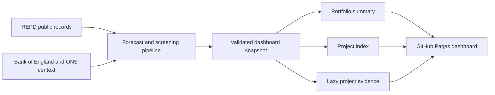

# UK Renewable Intelligence

[Live dashboard](https://uk-renewable-intelligence.github.io/) · [Modelling workspace](https://uk-renewable-project-screening.streamlit.app/)

A public decision-support dashboard for exploring the UK renewable project pipeline. It combines 13,009 Renewable Energy Planning Database records with transparent time-to-operation forecasts, project screening, geospatial analysis and bounded macroeconomic scenarios.

## What it does

- Searches and filters the complete 13,009-record public planning snapshot.
- Maps 12,980 projects with valid coordinates.
- Links 6,189 active projects to two-, three- and five-year operational forecasts.
- Shows dated planning evidence and shareable URLs for every project and filter view.
- Supports regional ranking, shortlists, side-by-side comparison, live grid context and an offshore engineering calculator.
- Explains temporal back-tests, data quality and known model limitations in the product.

## Engineering highlights

- Static GitHub Pages deployment with no sign-in and no sleeping server.
- Framework-free JavaScript and accessible native controls.
- Leaflet/OpenStreetMap geospatial workbench.
- Summary-first loading: the overview payload is about 244 KB; the project index and evidence are loaded only when needed.
- Integrity tests rebuild all 13,009 records from the published data shards and compare every source field.
- Forecast challengers are evaluated on temporal holdouts; the simpler survival baseline remains deployed when more complex candidates are less reliable.

## Data flow



## Run locally

Node.js 20 or newer is sufficient; the dashboard has no runtime package dependencies.

```bash
npm run build
npm run dev
```

Then open `http://127.0.0.1:4173/`.

Run the data and static-build checks with:

```bash
npm test
```

The build can use either `src/dashboard-data.json` from the modelling pipeline or reconstruct the source snapshot from the three published JSON files in the repository root.

## Model boundary

This is a research and early-stage screening tool, not investment advice. Public planning data cannot reveal private financing, land, supply-chain or contract terms, and the available historical snapshots are too limited to claim learned political or macroeconomic causality. External conditions are therefore exposed as explicit scenario assumptions rather than hidden inside the production forecast.
